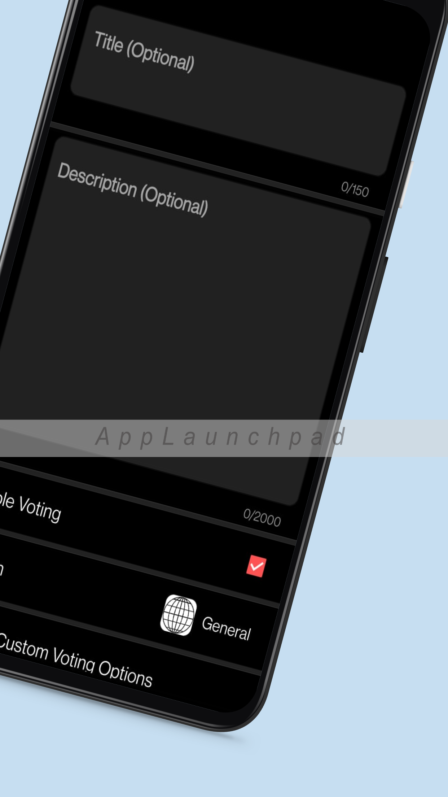
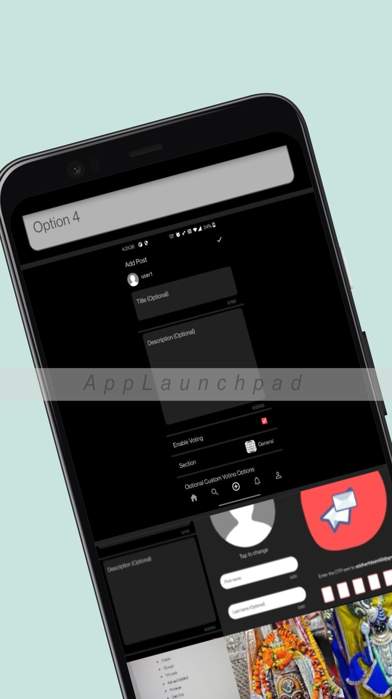
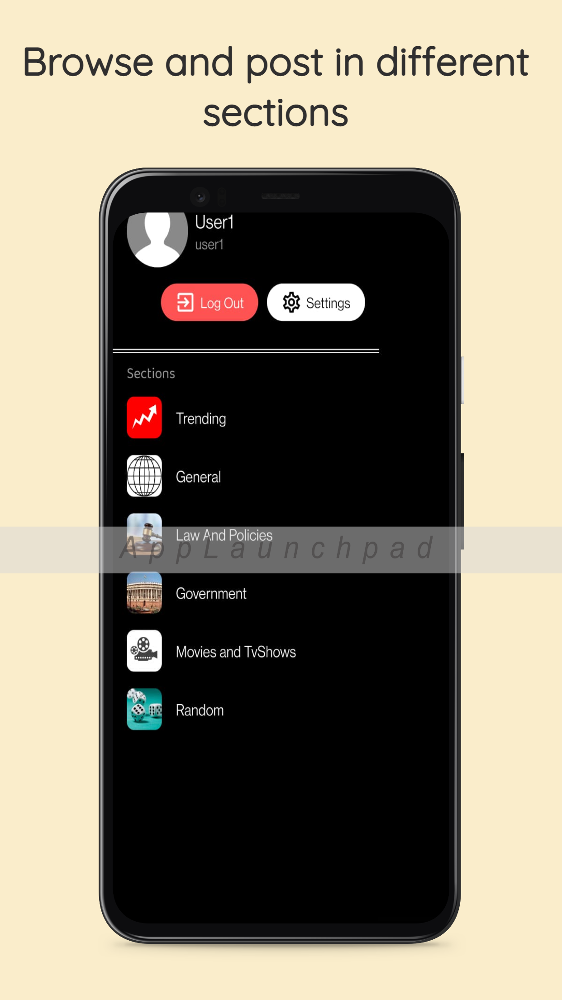
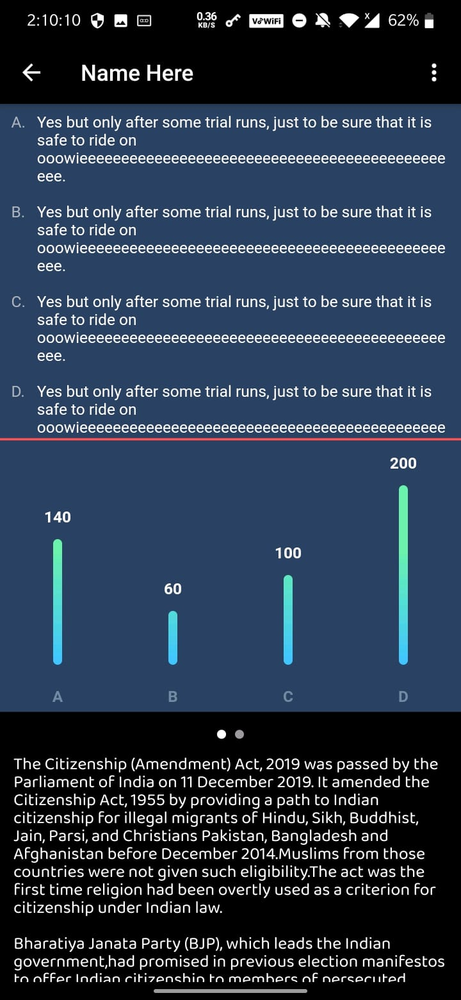
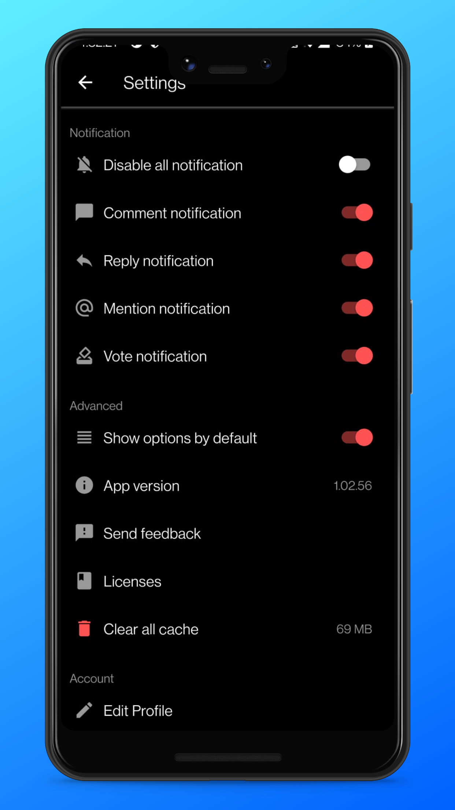

# Opinion

Opinion is a voting based social media platform where users can post images with description and provide voting options to understand other user's opinion. It was developed using [Django](https://www.djangoproject.com/) and [Firebase](https://firebase.google.com/) at the backend and [Flutter](https://flutter.dev/) as the frontend choice.

## Screenshots

## License

[MIT](https://choosealicense.com/licenses/mit/)
